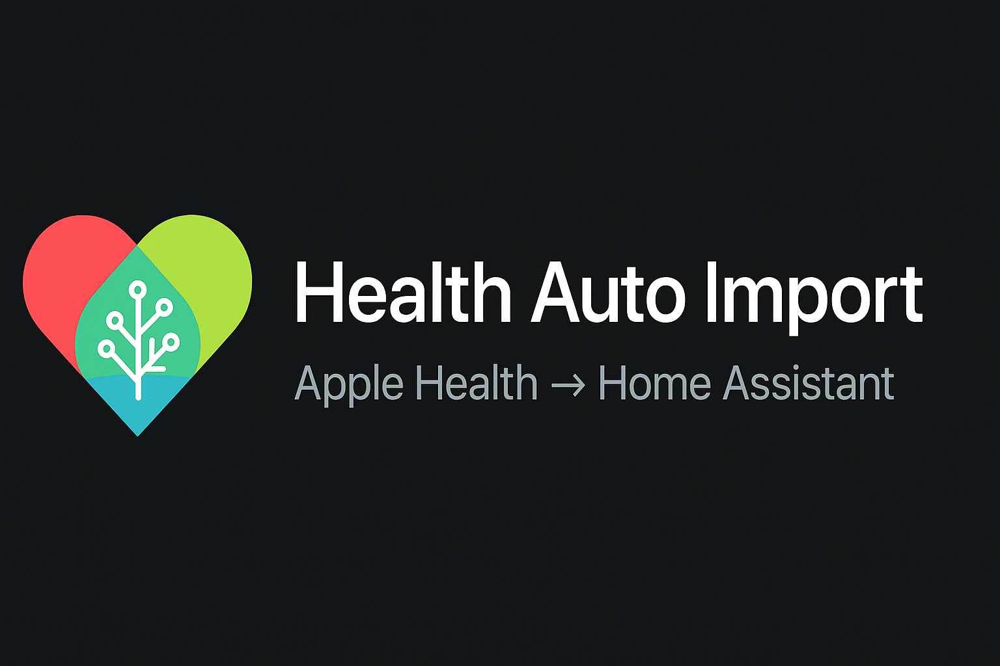

<p align="center">
  
</p>

# Health Auto Import

<p align="center">
  
</p>

A Home Assistant HACS integration — companion to the excellent [**Health Auto Export**](https://www.healthyapps.dev/) iOS app by [HealthyApps](https://healthyapps.dev/). Pulls Apple Health data into Home Assistant as **persistent, auto-discovered sensors**: ECG, heart rate, HR notifications, medications, vitals, workouts.

> **Status:** v1.5.0 — **on-demand HAE query services** (`health_auto_import.query_*`) let dashboards fetch historical records straight from Apple Health via the HAE server, with no local DB. Plus auto-discovered persistent sensors for ECG, workouts, heart rate notifications, medications, and 34 health metrics; full state persistence across restarts; per-device sync buttons; LCARS Sickbay data contract; daily-total sensors for cumulative metrics; tuned adaptive polling, per-metric watermarks, background startup, merge-based display caching. See [Known Issues](issues.md) for current limitations.

## What it does

Health Auto Export ships several ways to get HealthKit data off your iPhone or iPad — **MQTT**, **REST API**, **Home Assistant Sync**, **Dropbox / Google Drive / iCloud / Calendar**, and a built-in **TCP/MCP server**. Health Auto Import is a **pull-based companion** that connects to that TCP/MCP server and turns its responses into native Home Assistant entities.

| Health Auto Export option | Direction | Lands in HA as | Trade-off |
|---|---|---|---|
| MQTT automation | iPad → broker push | Whatever you template from raw MQTT JSON payloads | You own the parsing, retries, and topic schema |
| REST API automation | iPad → your URL push | Whatever your endpoint does with it | Need your own receiver service |
| Home Assistant Sync | iPad → HA REST push | A handful of pre-defined sensors | Limited to what HAE chose to expose |
| **Health Auto Import (this project)** | **HA pulls iPad** | **Auto-discovered persistent sensors per data type, formatted with proper units / device classes / state classes** | **Requires HAE running in the foreground (TCP server requirement)** |

### What makes it different

- **Persistent sensors, not templated MQTT payloads.** Each metric, ECG record, workout, notification, and medication becomes a first-class HA entity with the right `device_class`, `state_class`, and `unit_of_measurement`. Long-term statistics and history graphs just work.
- **Auto-discovery.** On setup the integration asks the server which tools it supports and which HealthKit metrics actually have data, then creates only the sensors that make sense for your device + watch + apps. Re-discovers nightly.
- **Adaptive per-sensor polling.** The integration measures each sensor's natural update cadence over a 14-day window and polls at half that gap — bounded to a configurable floor/ceiling. Weekly weight is not queried every minute; heart rate is not queried every hour.
- **One config entry per iPad/iPhone.** Multiple HAE devices on the same network coexist as separate HA devices.
- **Reachability sensor + recommended automation** so HA tells you the moment the iPad sleeps or HAE backgrounds.
- **HA does the heavy lifting** for retries, backoff, and error surfacing — the HAE app just answers questions over TCP.

## Credit & attribution

This project is **not affiliated with HealthyApps**. It depends entirely on the work of the Health Auto Export team — please support them:

- App: [Health Auto Export on the App Store](https://apps.apple.com/us/app/health-auto-export-json-csv/id1115567069)
- Website: [healthyapps.dev](https://www.healthyapps.dev/)
- Help center: [help.healthyapps.dev](https://help.healthyapps.dev/en/)
- Server connection docs: [help.healthyapps.dev/.../server-connection](https://help.healthyapps.dev/en/health-auto-export/automations/server-connection/)
- Community: [Discord](https://discord.gg/PY7urEVDnj) · [Reddit](https://www.reddit.com/r/healthautoexport/)

The TCP/MCP server feature is part of HAE's **Premium** subscription. Buying Premium directly funds the upstream project this integration relies on.

## Install

### HACS (custom repository)
1. HACS → **Integrations** → **⋮** → **Custom repositories**.
2. Paste `https://github.com/leithma/health-auto-import`, category **Integration**, click **Add**.
3. Search for **Health Auto Import** and **Download**.
4. Restart Home Assistant.

### Manual
Copy `custom_components/health_auto_import/` to `<config>/custom_components/` and restart.

## Configure

1. On the iPad/iPhone: open Health Auto Export → **Server** → **Start Server**, note the IP and port (default `9000`). Make sure server version is **v1.0**.
2. In HA: **Settings → Devices & Services → Add Integration → Health Auto Import**.
3. Enter the IP and port from step 1. The integration connects, verifies, and creates the device.

## Requirements on the iPad

- Health Auto Export **Premium** subscription (the TCP server feature is paid — and the right way to thank the upstream team).
- HAE must run in the **foreground**. Use Guided Access / Single App Mode and Auto-Lock = Never, ideally on a charger.
- HA host and iPad on the same LAN.

## Reachability automation

The `binary_sensor.health_auto_import_<host>_reachable` flips OFF when the iPad goes to sleep / HAE backgrounds. Pattern:

```yaml
alias: "Health Auto Import: server unreachable"
trigger:
  - platform: state
    entity_id: binary_sensor.health_auto_import_<host_slug>_reachable
    to: "off"
    for: "00:05:00"
action:
  - service: notify.notify
    data:
      title: "Health Auto Import offline"
      message: "Wake the device and re-open Health Auto Export."
```

## Known issues

See [issues.md](issues.md) for full details and diagnostic evidence.

| # | Issue | Status | Severity |
|---|-------|--------|----------|
| 1 | HAE TCP server and UI freeze after ~2–3 min of polling | Open — upstream HAE app bug | Critical |
| 2 | Sensors show "Unavailable" during freeze | Open — expected behavior | Medium |
| 3 | "receive failed" NWError 89 in HAE logs | Closed — benign log noise | Low |
| 4 | Unit mapping mismatches causing recorder warnings | Fixed in v1.0.0 | Medium |
| 5 | Slow initial setup (~30s) | Fixed in v1.0.0 | Medium |
| 6 | Infrequent health metrics showing Unknown | Fixed in v1.0.0 | Medium |
| 7 | All sensors Unknown after restart | Fixed in v1.0.0 | Medium |

**The #1 blocker is the HAE app freezing after ~2–3 minutes of polling.** The app freezes even in the foreground — the UI locks up and the TCP server stops responding. The integration is as resilient as possible — sensors go Unavailable during a freeze and recover when the app is force-closed and reopened.

### Changelog highlights

| Version | Changes |
|---------|---------|
| v1.5.0 | **On-demand query services.** `health_auto_import.query_ecg`, `query_workouts`, `query_metrics`, `query_medications`, `query_heart_notifications`, and generic `query` — all `SupportsResponse.ONLY` pass-throughs to the HAE TCP server. Dashboards can fetch any date range on demand without local caching; Apple Health stays the source of truth. Latest-record sensors unchanged. See [HealthHandoff/06-on-demand-query-architecture.md](HealthHandoff/06-on-demand-query-architecture.md) for the recommended LCARS integration pattern |
| v1.4.3 | Workouts request `includeMetadata` so HR series populates on fresh fetches; `km` → `m` distance conversion; flexible HR parsing |
| v1.4.2 | ECG voltage crash fix — `_safe_attr` always returns `dict\|None`; ECG waveform downsampled to 2000 points to fit HA's 40 KiB attribute cap |
| v1.4.1 | Restore from persisted state when discovery fails (server offline at HA boot) |
| v1.4.0 | **Full state persistence.** Sensor data survives HA restarts even when the HAE server is offline. Non-metric tools (workouts, ECG) merge new records instead of replacing. Workout energy rounded to 1 decimal |
| v1.3.0 | **Per-device sync buttons.** Sync ECG, workouts, health metrics, medications, and heart notifications individually from each device page |
| v1.2.0 | **Persistent sensor values.** Sensors retain last-known data when the HAE server is unreachable — no more Unknown/Unavailable flapping. Only sensors that have never received a value show Unknown |
| v1.1.0 | **LCARS Sickbay data contract.** ECG voltage waveform array, sleep-analysis stage segments, workout HR time-series samples, GPS route as Google-encoded polyline, `lcars_schema_version` probe attribute |
| v1.0.0 | **First stable release.** New brand icon & README imagery. Daily-total sensors for cumulative metrics, reorganized dashboard, tuned adaptive polling (91% TCP call reduction), per-metric watermarks, background startup sequencing, merge-based display caching, unit mapping fixes, `dt_util` import fix |

## On-demand query services (v1.5.0+)

In addition to the live sensors, six HA services let dashboards pull historical records straight from Apple Health on demand. The integration is a thin pass-through — no caching, no local DB, no schema migration.

| Service | Purpose |
|---------|---------|
| `health_auto_import.query` | Generic — any tool, any arguments |
| `health_auto_import.query_ecg` | ECG records (with voltage waveform) |
| `health_auto_import.query_workouts` | Workouts (HR series + GPS route optional) |
| `health_auto_import.query_metrics` | Health metric buckets (steps, HR, sleep, …) |
| `health_auto_import.query_medications` | Medication log |
| `health_auto_import.query_heart_notifications` | High/low/irregular HR notifications |

All accept `start` / `end` (ISO datetime), `days` (lookback shortcut), and `limit` (cap N most recent). All are registered with `SupportsResponse.ONLY`, so callers must pass `return_response: true`.

Example from a Lovelace card / frontend:

```js
const { response } = await hass.callWS({
  type: 'call_service',
  domain: 'health_auto_import',
  service: 'query_workouts',
  service_data: { days: 90, limit: 20, include_routes: true },
  return_response: true,
});
// response = { tool, count, arguments, data: { workouts: [...] } }
```

See [HealthHandoff/06-on-demand-query-architecture.md](HealthHandoff/06-on-demand-query-architecture.md) for the full LCARS integration spec.

## Spec & design

- [plans/v0.1-integration-spec.md](plans/v0.1-integration-spec.md) — current build spec (auto-discovery, watermarks, sensor definitions)

## License

MIT — see [LICENSE](LICENSE).
